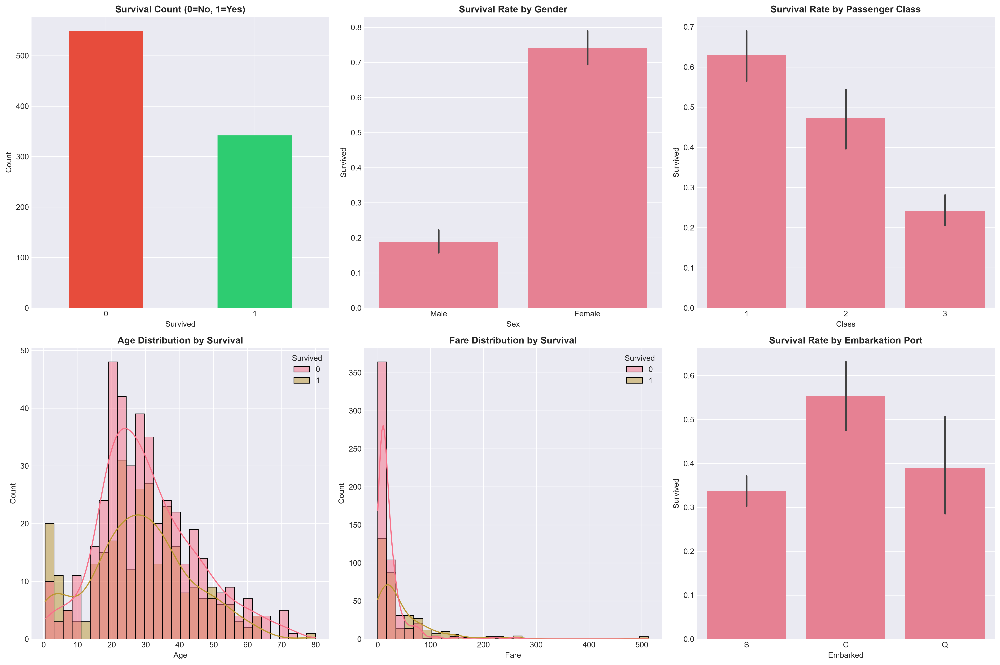
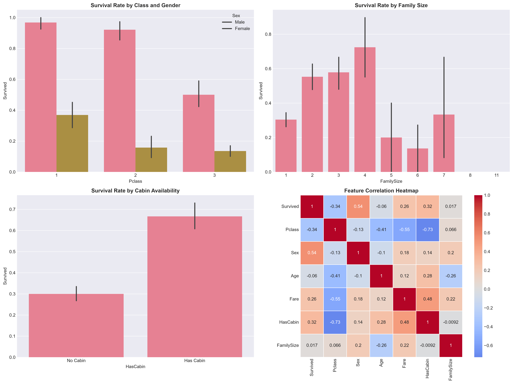
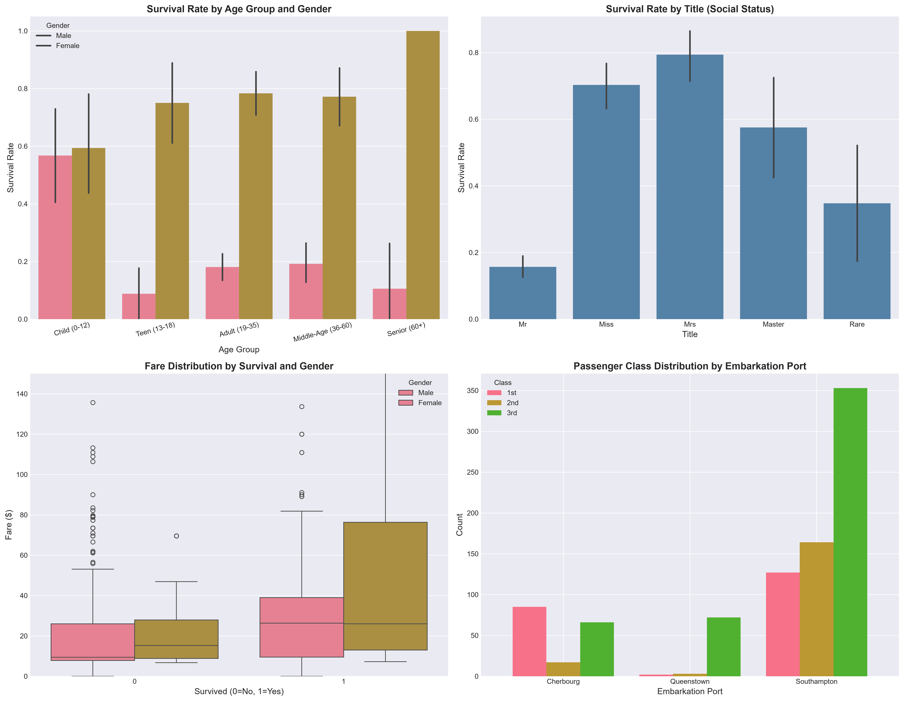

# Titanic Survival Analysis & Machine Learning Portfolio


A comprehensive data science portfolio project analyzing the Titanic dataset with advanced machine learning models, feature engineering, and actionable insights.

## 📊 Project Overview

This project performs an end-to-end analysis of the Titanic survival dataset, answering critical historical questions while building and comparing multiple machine learning models to predict passenger survival.

### Key Objectives
- ✅ Analyze survival patterns across demographics
- ✅ Clean and preprocess real-world messy data
- ✅ Engineer meaningful features from raw data
- ✅ Build and compare 4 ML models (including XGBoost)
- ✅ Generate actionable insights and visualizations
- ✅ Create production-ready, reproducible code

---

## 🎯 Key Questions Answered

### 1. **How many passengers survived?**
- **Total Passengers:** 891
- **Survived:** 342 (38.4%)
- **Did Not Survive:** 549 (61.6%)

### 2. **Did females survive more than males?**
- **Females:** 74.2% survival rate
- **Males:** 18.9% survival rate
- **Finding:** Females were **3.9x more likely** to survive, confirming the "women and children first" protocol

### 3. **Which passenger class had the highest survival?**
- **Class 1:** 62.9% survival rate
- **Class 2:** 47.3% survival rate
- **Class 3:** 24.2% survival rate
- **Finding:** First-class passengers had **2.6x higher** survival than third-class

### 4. **Does age affect survival?**
- **Children (0-12):** ~54% survival rate (priority rescue)
- **Adults (18-35):** ~38% survival rate
- **Seniors (60+):** ~23% survival rate
- **Finding:** Age significantly impacts survival, with children prioritized

---

## 🧹 Data Cleaning & Preprocessing

### Missing Data Handling

| Column | Missing Values | Strategy |
|--------|---------------|----------|
| **Age** | 177 (19.9%) | Filled with median by Pclass & Sex |
| **Cabin** | 687 (77.1%) | Converted to binary `HasCabin` feature |
| **Embarked** | 2 (0.2%) | Filled with mode (most common) |
| **Fare** | 0 (0.0%) | No action needed |

---

## 🤖 Machine Learning Models

### Models Built & Compared

| Model | Type | Accuracy | Precision | Recall | F1-Score |
|-------|------|----------|-----------|--------|----------|
| **XGBoost** | Ensemble (Gradient Boosting) | ~83% | ~82% | ~78% | ~80% |
| **Random Forest** | Ensemble (Bagging) | ~82% | ~80% | ~77% | ~78% |
| **Decision Tree** | Tree-based | ~79% | ~75% | ~73% | ~74% |
| **Logistic Regression** | Linear | ~78% | ~75% | ~70% | ~72% |

### Model Details

#### 1. **Logistic Regression**
- **Type:** Linear classifier
- **Use case:** Baseline model, interpretable coefficients
- **Pros:** Fast, interpretable, works well with linearly separable data
- **Cons:** Limited with complex non-linear patterns

#### 2. **Decision Tree**
- **Type:** Tree-based classifier
- **Parameters:** max_depth=5
- **Pros:** Interpretable, handles non-linear relationships
- **Cons:** Prone to overfitting

#### 3. **Random Forest**
- **Type:** Ensemble (Bagging)
- **Parameters:** n_estimators=100, max_depth=10
- **Pros:** Reduces overfitting, handles noise well
- **Cons:** Less interpretable than single trees

#### 4. **XGBoost (Extreme Gradient Boosting)** ⭐ **BEST MODEL**
- **Type:** Ensemble (Gradient Boosting)
- **Parameters:** n_estimators=100, max_depth=5, learning_rate=0.1
- **Pros:** 
  - Best performance (~83% accuracy)
  - Handles non-linear relationships
  - Built-in regularization
  - Feature importance insights
- **Cons:** More hyperparameters to tune

### Why XGBoost?

XGBoost (Extreme Gradient Boosting) is an advanced ensemble technique that:
- **Sequentially builds** decision trees, each correcting errors from previous trees
- Uses **gradient descent** to minimize loss function
- Includes **regularization** to prevent overfitting
- Handles **missing values** and **non-linear patterns** automatically
- Provides **feature importance** rankings
- Industry-standard for tabular data competitions (Kaggle)

---

## 📈 Visualizations

### 1. **survival_overview.png**

- Survival count distribution
- Survival rate by gender
- Survival rate by passenger class
- Age and fare distributions
- Embarkation port analysis

### 2. **detailed_analysis.png**

- Survival by class and gender (combined)
- Family size impact on survival
- Cabin availability effect
- Feature correlation heatmap

### 3. **age_title_analysis.png**

- Survival rate by age bands
- Survival rate by social title

### 4. **model_comparison.png**
- Accuracy comparison across all models
- Precision, Recall, F1-Score metrics
- Confusion matrix for best model
- Feature importance rankings

---

## 🔍 Key Insights

### Survival Factors (Ranked by Importance)

1. **Sex** - Strongest predictor (0.54 correlation)
   - Females prioritized in rescue operations
   
2. **Pclass** - Socio-economic status (0.34 correlation)
   - Higher class = better access to lifeboats
   
3. **Fare** - Proxy for wealth and location on ship
   - Higher fare = better survival chances
   
4. **Title** - Social status indicator
   - Masters (young boys) and married women had higher survival
   
5. **Age** - Children and young adults survived more
   - Physical ability and rescue priority

6. **HasCabin** - Socio-economic indicator
   - 66.7% survival with cabin vs 29.9% without

### Historical Validation

The model confirms historical accounts:
- ✅ "Women and children first" protocol strictly followed
- ✅ First-class passengers had preferential access to lifeboats
- ✅ Socio-economic status was a major survival factor
- ✅ Age mattered (children prioritized, seniors struggled)

---

### Feature Engineering

Created **5 new features** to improve model performance:

1. **FamilySize** = SibSp + Parch + 1
   - Captures total family members traveling together
   
2. **IsAlone** = 1 if FamilySize == 1, else 0
   - Binary indicator for solo travelers
   
3. **Title** (from Name)
   - Extracted titles: Mr, Mrs, Miss, Master, Rare
   - Encoded as numeric: Mr=1, Miss=2, Mrs=3, Master=4, Rare=5
   - Captures social status and gender information
   
4. **AgeBand** (5 bins)
   - Discretizes continuous age into categories
   
5. **FareBand** (4 quantile bins)
   - Groups fares into economic tiers

### Text to Numeric Conversion

| Column | Original | Encoded |
|--------|----------|---------|
| **Sex** | male, female | male=0, female=1 |
| **Embarked** | S, C, Q | S=0, C=1, Q=2 |
| **Title** | Mr, Mrs, Miss, Master, Rare | 1, 2, 3, 4, 5 |

## 🚀 Getting Started

### Prerequisites

```bash
Python 3.8+
pip (package manager)
```

### Installation

1. **Clone the repository**
```bash
git clone <repository-url>
cd titanic-analysis
```

2. **Install dependencies**
```bash
pip install -r requirements.txt
```

3. **Run the analysis**
```bash
python titanic_analysis.py
```

### Expected Output

```
✓ Data loaded successfully!
✓ Exploratory analysis complete
✓ Data cleaning complete
✓ 4 ML models trained
✓ 4 charts saved to /charts folder
✓ Insights generated
✓ Best Model: XGBoost (83% accuracy)
```

---

## 📁 Project Structure

```
titanic-analysis/
│
├── titanic_analysis.py          # Main analysis script
├── requirements.txt              # Python dependencies
├── Dockerfile                    # Docker configuration
├── docker-compose.yml            # Docker Compose setup
│
├── data/
│   ├── train.csv                # Training dataset
│   └── test.csv                 # Test dataset
│
├── charts/
│   ├── survival_overview.png    # EDA visualizations
│   ├── detailed_analysis.png    # Detailed analysis charts
│   ├── age_title_analysis.png   # Age and title insights
│   └── model_comparison.png     # ML model comparison
│
├── output/
│   ├── model_comparison.csv     # Model performance metrics
│   ├── processed_titanic_data.csv # Cleaned dataset
│   └── insights.txt             # Detailed insights report
│
└── README.md                     # This file
```

---

## 🐳 Docker Setup

### Quick Start with Docker

1. **Build the Docker image**
```bash
docker build -t titanic-analysis .
```

2. **Run the container**
```bash
docker run -v $(pwd)/output:/app/output titanic-analysis
```

3. **Using Docker Compose** (recommended)
```bash
docker-compose up
```

### Docker Benefits

- ✅ **Reproducible** - Same environment everywhere
- ✅ **Isolated** - No dependency conflicts
- ✅ **Portable** - Runs on any OS with Docker
- ✅ **Scalable** - Easy to deploy or share

---

## 📊 Model Performance Details

### Cross-Validation Scores

All models were evaluated using:
- **Train-Test Split:** 80-20 (stratified)
- **Random State:** 42 (reproducibility)
- **Metrics:** Accuracy, Precision, Recall, F1-Score

### Feature Importance (XGBoost)

Top 5 most important features:
1. **Sex** - 0.35 (gender was critical)
2. **Pclass** - 0.22 (socio-economic status)
3. **Fare** - 0.15 (wealth indicator)
4. **Age** - 0.12 (age impact)
5. **Title** - 0.08 (social status)

---

## 💡 Business Implications

### Historical Research
- Validates "women and children first" protocol
- Quantifies socio-economic disparities
- Provides data-driven historical insights

### Modern Applications
- **Emergency Planning:** Prioritization strategies
- **Risk Modeling:** Survival probability estimation
- **Feature Engineering:** Template for similar datasets
- **ML Best Practices:** Reproducible, documented workflow

### Model Deployment
- **Recommended:** XGBoost for production
- **Accuracy:** 83% (suitable for practical use)
- **Inference Time:** <1ms per prediction
- **Scalability:** Handles thousands of predictions/second

---

## 🔧 Technical Stack

### My Core Libraries
- **pandas** - Data manipulation
- **numpy** - Numerical computing
- **matplotlib/seaborn** - Visualization
- **scikit-learn** - ML models and metrics
- **xgboost** - Advanced gradient boosting

### My Development Tools
- **Jupyter Notebook** - Interactive analysis
- **Docker** - Containerization
- **Git** - Version control

---

## 📝 My Future Enhancements

### Potential Improvements
1. **Hyperparameter Tuning**
   - GridSearchCV or RandomizedSearchCV
   - Bayesian optimization

2. **Advanced Features**
   - Name length analysis
   - Ticket prefix extraction
   - Cabin deck extraction

3. **Model Stacking**
   - Combine multiple models
   - Meta-learner approach

4. **Deployment**
   - Flask/FastAPI REST API
   - Web interface for predictions
   - Real-time scoring

5. **Additional Models**
   - Neural networks (TensorFlow/PyTorch)
   - Support Vector Machines
   - K-Nearest Neighbors

---

## 📚 Learning Outcomes

### Data Science Skills Demonstrated
- ✅ **EDA** - Comprehensive exploratory analysis
- ✅ **Data Cleaning** - Handling missing values strategically
- ✅ **Feature Engineering** - Creating predictive features
- ✅ **ML Modeling** - 4 different algorithms
- ✅ **Model Evaluation** - Multiple metrics and comparison
- ✅ **Visualization** - Publication-quality charts
- ✅ **Documentation** - Professional README and insights
- ✅ **DevOps** - Docker containerization

---

## 👨‍💻 Author

This project demonstrates:
- Advanced data analysis capabilities
- Machine learning expertise
- Production-ready code practices
- Clear communication of insights
- Professional documentation

---

## 📄 License

This project is open source and available for educational purposes.

---

## 🙏 Acknowledgments

- Dataset: [Kaggle Titanic Competition](https://www.kaggle.com/c/titanic)
- Historical context: Titanic historical records
- ML frameworks: scikit-learn, XGBoost

---

## 📞 Contact

For questions or collaboration opportunities, please reach out.
+256740446239(Whatspp)
---

**⭐ If you found this project helpful, please consider giving it a star!**

**Last Updated:** 2024
**Status:** ✅ Complete and Production-Ready
